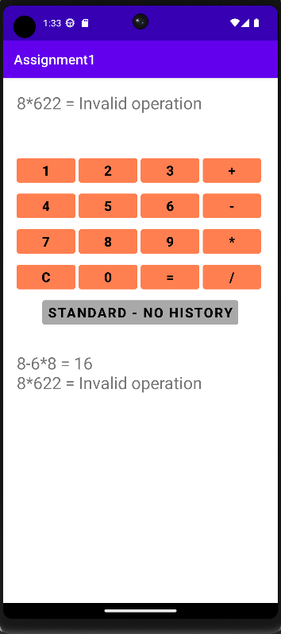

# SimpleCalculatorApp

Following requirements are considered:
- Calculate only single digit operands
- All operators are calculated in the order of entering from left to right (no priority)/All operators and operands need to be entered in sequence i.e operand then operator then operand then operator and so on
- Valid result is returned if the user follow the sequence to perform the calculation
- Invalid operation is returned if the user don't follow the sequence
- The app has two modes Standard and Advanced
- Advance Mode will show all the history of all the calculations performed by the user
- Standard Mode will just show the current calculation
- User has to press C to clear the display
- App has one activity only and it is designed using Linear Layout

